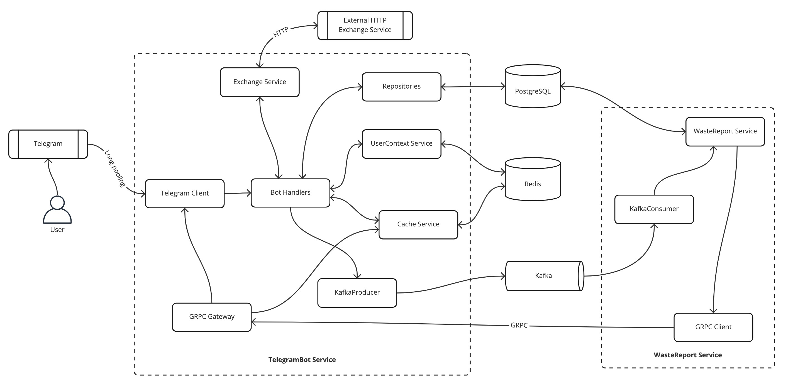

# Телеграм бот для учета трат

## Структура проекта

### `cmd`

- `bot` - основной сервис с телеграм ботом
- `report-service` - сервис получения отчетов по тратам за период времени
- `migrate` - cli для обновления файлов atlas миграции для базы данных

### `internal`

- `api` - proto файлы для grpc взаимодействия с сервисом бота
- `app` - пакет для запуска приложения
- `bot` - бизнес-логика бота, обработка сообщений
- `clients` - клиенты для внешних сервисов
  - `exchange` - клиент внешнего http сервиса с данными о курсе валют
  - `grpc` - клиент для общения `report-service` с сервисом `bot`
  - `telegram` - клиент для взаимодействия с telegram
- `ent` - сгенерированные файлы для работы с PostgreSQL
- `grpc` - компонент grpc-сервера
- `http` - компонент http-роутера
- `metrics` - декораторы для подстчета метрик и трейсинга
- `migrations` - сгенированные файлы atlas миграции для базы данных
- `models` - модели базы данных
- `repository` - репозитории для взаимодействия с базой данных
- `service` - внутренние сервисы
  - `cache` - сервис кеширования
  - `exchange` - сервис получения курса валют
  - `kafka` - взаимодействие `bot` и `report-service` через очередь сообщений
  - `usercontext` - контекст общения с пользователями, хранящийся в redis
  - `wastereport` - сервис генерации отчета по тратам

### `pkg`

- `log` - интерфейс и реализация для логгера для всего проекта

## Архитектура

[Pdf файл](./docs/gohw-4.pdf) с архитектурой сервиса и расчетами нагрузки на 1000, 100000 и 1000000 пользователей (ДЗ 4)

## Инфраструктура

- Метрики сервиса: [http://localhost:8080/metrics](http://localhost:8080/metrics)
- Graylog: [http://localhost:7555](http://localhost:7555)
- Prometheus: [http://localhost:9090](http://localhost:9090)
- Grafana: [http://localhost:3000](http://localhost:3000)
- Jaeger: [http://localhost:16686](http://localhost:16686)

## Задания

### 1 неделя

Продолжить работу над ботом, каркас которого создали на воркшопе.

Нужно добавить функционал:

- Команда добавления новой финансовой "траты". В трате должна присутствовать сумма, категория и дата. Но можете добавить еще поля, если считаете нужным. Придумайте, как оформить команду так, чтобы пользователю было удобно ее использовать.
- Хранение трат в памяти, базы данных пока не используем.
- Команда запроса отчета за последнюю неделю/месяц/год. В отчете должны быть суммы трат по категориям.

### 2 неделя

Нужно в нашем боте добавить новый функционал:

1. Команда переключения бота на конкретную валюту - "выбрать валюту"
2. После ввода команды бот предлагает выбрать интересующую валюту из четырех: USD, CNY, EUR, RUB
3. При нажатии на нужную валюту переключаем бота на нее - результат получение трат конвертируется в выбранную валюту.
4. Храним траты всегда в рублях, конвертацию используем только для отображения, ввода и отчетов

_Особенности_

1. При запуске сервиса мы в отдельном потоке запрашиваем курсы валют.
2. Запрос курса валют происходит из любого из открытых источников.
3. Сервис должен завершаться gracefully.

### 3 неделя

1. Завести PostgreSQL в Docker, резметить таблички и схемы, любые действия с БД проводить только через миграции
2. Перенести хранение данных из памяти приложения в базу данных
3. Добавить бюджеты/лимиты на траты в месяц, при проведении транзакций проверять согласованность данных (превышен ли бюджет и тд)
4. Сгенерировать тестовые данные для таблицы расходов
5. Создать индексы на таблицу расходов, в комментариях к миграции пояснить выбор индексируемых колонок и типа индекса

_Что будет оцениваться:_

- низкая связность кода, зависимости через интерфейсы
- нормализованная структура данных в БД
- правильность обработки транзакций и ошибок

_Дополнительные задания:_

- покрыть бизнес логику тестами, взаимодействие с базой замокать
- интеграционные тесты на sql код

### 4 неделя

_Задание_

Нарисовать три схемы на (1000, 100 000, 1 000 000 пользователей). Сделать это можно в любом подходящем для этого редакторе (app.diagrams.net, miro.com, etc...).
При проектировании на схеме необходимо создать табличку где будем указывать следующие вводные, разберем на примере сервиса почтовых рассылок.

**Функциональные требования (зачем нужен сервис, какую проблему он решает):**

- отправляет почтовые рассылки
- позволяет тестировать а/б
- предоставляет статистику

**Не функциональные требования:**

- высокая скорость работы
- высокая отказоустойчивость

**Дополнительные требования:**

- возможность push нотификаций
- отслеживания доставки в реальном времени на grafana

**Нагрузка:**

- n RPS (средняя, максимальная)

**Оценка хранилища:**

- за год мы отправим n сообщений
- в год мы ожидаем прирост на n петабайт для хранения данных
- через n времени необходимо будет реплицировать базу, перевести запросы на чтение с асинхронной реплики для аналитики
- бекапы (x3 к размеру данных)

**Оценка размера оперативной памяти:**

- Базе данных требуется n ГБ на инстанс
- Кеш хранит 20% запросов за 24 часа, в среднем сообщение занимает n byte, необходимо n гигабайт памяти.

Вам необходимо сделать оценку по данному шаблону, с вашими цифрами и формулировками по сервису учета расходов. Табличку можно сделать общую на три схемы.

### 5 неделя

1. Перевести бота на ведение структурированных логов в STDOUT.
2. Инструментировать код трейсингом. Создавать спан на каждое пришедшее сообщение. Корректно прокидывать контекст внутрь дерева функций и покрыть спанами важные части.
3. Добавить метрики количества сообщений и времени обработки одного сообщения от пользователя. Разбить эти метрики по разным типам команд.

_Задания на бонусы:_

1. Придумать и реализовать еще несколько полезных метрик для своего бота
2. Добавить в свой композ-файл и настроить инфраструктуру сбора метрик и создать рабочий дашборд с несколькими панелями в Графане
3. Добавить в композ-файл и настроить инфраструктуру сбора трейсов. Трейсы должны успешно искаться через веб-интерфейс Jaeger

### 6 неделя

_Задание_

Нужно в нашем боте добавить функционал кэширования расходов из отчета:

1. Если пользователь уже запрашивал отчет за конкретный период, то возвращать расходы по нему из кэша
2. Для кэширования использовать либо LRU с воркшопа, либо любое другое решение, например, Redis или Memcache

### 7 неделя

Добавить сервис по построению произвольных отчетов вашего бота.
Сервис должен быть реализован как отдельный микросервис, который запускается вместе с остальными в вашем компоуз файле.

Взаимодействие с сервисом построения отчетов осуществляется следующим образом:

1. пользователь выбирает в телеграм боте построить n отчет
2. сервис телеграм бота отправляет (продюсит) запрос на построение отчета в кафку
3. сервис построения отчетов потребляет (консюмит) сообщение из кафки, формирует нужный отчет
4. вызывает сервис телеграм бота по gRPC с результатами отчета
5. результаты возвращаются пользователю в телеграм

_Задания на бонусы:_

- добавить в интерцепторы gRPC метрики на вызываемые методы
- добавить метрики в продюсере и консюмере
- создать на стороне сервера grpc-gateway с возможностью вызова по gRPC и с помощью RESTful API
- добавить валидацию запросов путем добавления плагина в proto файле
